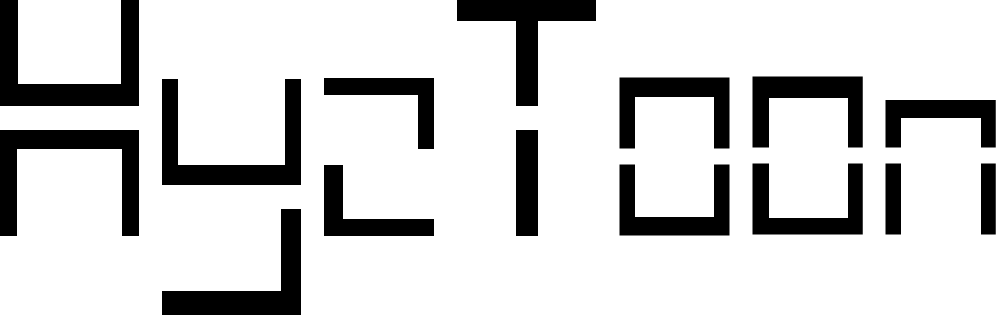
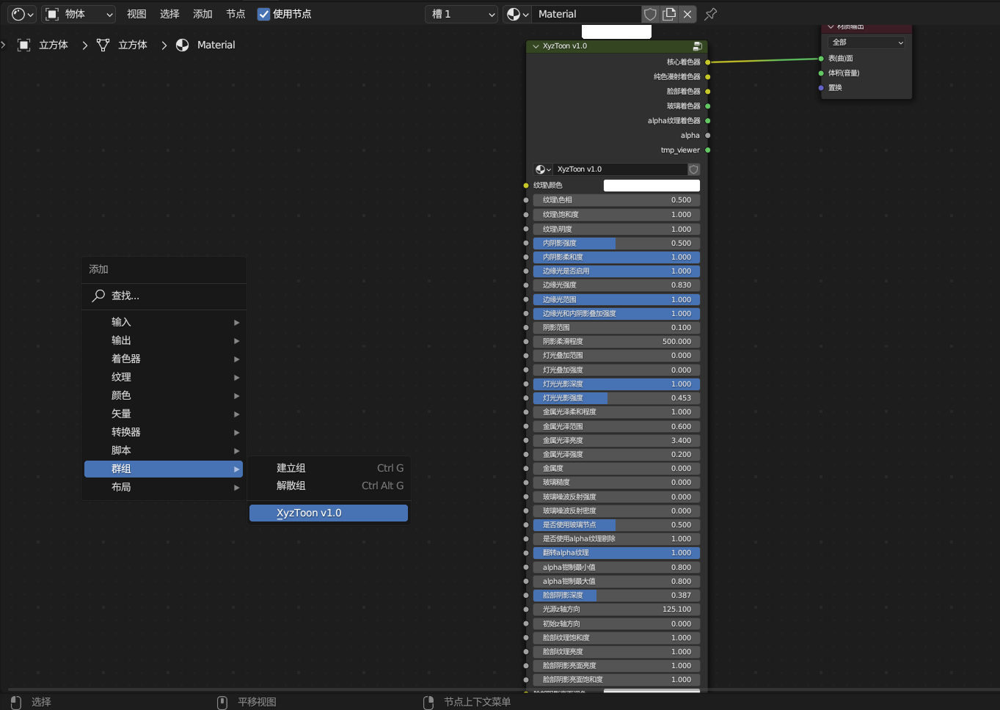

# XyzToon

## Function Introduction

#### This plugin allows you to quickly import from [Xyz25632/FR](https://space.bilibili.com/1043824308?spm_id_from=333.337.0.0) Create three shading and two node presets, and use them in a parameterized manner to modify the presets.

#### When the plugin is enabled, the "XyzToon Settings" category can usually be seen on the panel called out with the n key in the VIEW-3D layout, and the words "XyzToon enabled" can be seen on the panel of that category:

#### When the plugin is enabled, you should be able to see node groups containing the words "XyzToon" in the "Group" category of the new node menu called up in the node editor interface:

## Known issues

#### Do not open any .blend files located in the NodeTREE folder within the plugin installation path when enabling this plugin, as this operation is known to cause the blend to crash.