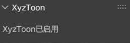

# XyzToon

## Function Introduction

#### This plugin allows you to quickly import from [Xyz25632/FR](https://space.bilibili.com/1043824308?spm_id_from=333.337.0.0) Create three shading and two node presets, and use them in a parameterized manner to modify the presets.

#### When the plugin is enabled, the "XyzToon Settings" category can usually be seen on the panel called out with the n key in the VIEW-3D layout, and the words "XyzToon enabled" can be seen on the panel of that category:

#### When the plugin is enabled, you should be able to see node groups containing the words "XyzToon" in the "Group" category of the new node menu called up in the node editor interface:

## Known issues

#### Do not open any .blend files located in the NodeTREE folder within the plugin installation path when enabling this plugin, as this operation is known to cause the blend to crash.

# @README_CN:

# XyzToon

## 功能介绍

#### 该插件可以让您快速地导入由[Xyz25632/FR](https://space.bilibili.com/1043824308?spm_id_from=333.337.0.0)制作的三渲二节点预设，并且以参数化的方式使用改预设。

#### 当改插件被启用时，通常可以在VIEW_3D布局中使用n键呼出的面板上看到"XyzToon设置"类别，且可以在该类别的面板上看到"XyzToon已启用"字样:

#### 当该插件启用时，您应该可以在节点编辑器界面呼出的新建节点菜单的"群组"类别中看到包含"XyzToon"字样的节点组:

## 已知问题

#### 请勿在启用该插件时打开位于插件安装路径内的NodeTREE文件夹内的任意.blend文件，已知该操作会导致blender闪退。
