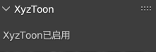
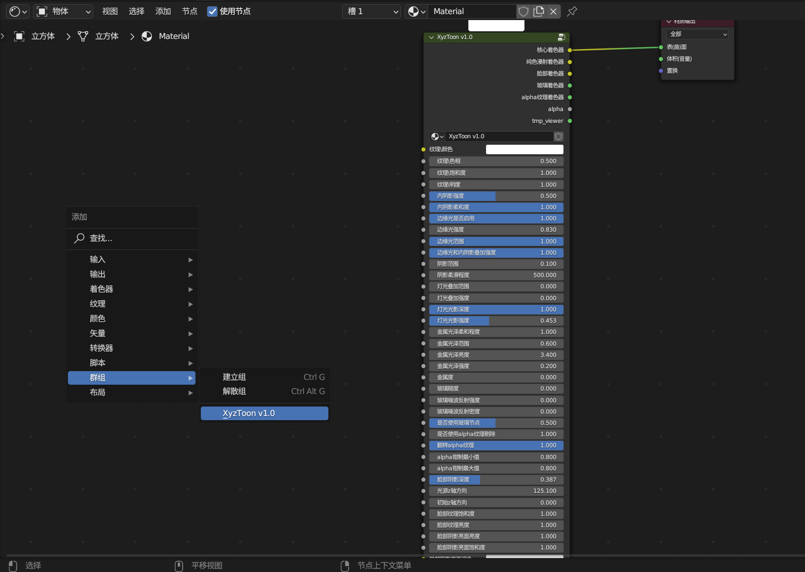

# XyzToon

## 功能介绍

#### 该插件可以让您快速地导入由[Xyz25632/FR](https://space.bilibili.com/1043824308?spm_id_from=333.337.0.0)制作的三渲二节点预设，并且以参数化的方式使用改预设。

#### 当改插件被启用时，通常可以在VIEW_3D布局中使用n键呼出的面板上看到"XyzToon设置"类别，且可以在该类别的面板上看到"XyzToon已启用"字样:

#### 当该插件启用时，您应该可以在节点编辑器界面呼出的新建节点菜单的"群组"类别中看到包含"XyzToon"字样的节点组:

## 已知问题

#### 请勿在启用该插件时打开位于插件安装路径内的NodeTREE文件夹内的任意.blend文件，已知该操作会导致blender闪退。